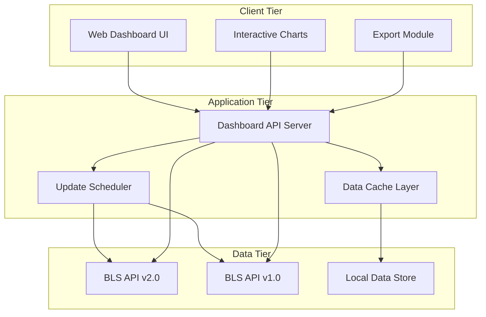

# Design Document: Economic Indicators Dashboard

## Overview

The Economic Indicators Dashboard is a modern web application that provides Federal Reserve economists with real-time access to key economic indicators from the Bureau of Labor Statistics (BLS). The system integrates with both BLS API v1.0 and v2.0 to retrieve, visualize, and export critical economic data including Consumer Price Index (CPI), Producer Price Index (PPI), unemployment rates, employment statistics, labor force participation rates, and average hourly earnings.

The application follows a client-server architecture with a responsive web frontend and a robust backend API service. The design emphasizes performance, reliability, and professional presentation suitable for Federal Reserve use cases.

## Architecture

The system employs a three-tier architecture:



### Key Architectural Decisions

1. **Dual API Integration**: Primary use of BLS API v2.0 with automatic fallback to v1.0 for reliability
2. **Caching Strategy**: Local data caching to reduce API calls and improve response times
3. **Responsive Design**: Mobile-first approach ensuring usability across all device types
4. **Modular Frontend**: Component-based architecture for maintainability and reusability

## Components and Interfaces

### Frontend Components

#### Dashboard Controller
- **Purpose**: Main application orchestrator and state management
- **Responsibilities**: 
  - Coordinate data fetching and display
  - Manage application state and user interactions
  - Handle error states and loading indicators
- **Interface**: Exposes methods for data refresh, indicator selection, and export operations

#### Visualization Engine
- **Purpose**: Render interactive charts and graphs for economic data
- **Responsibilities**:
  - Create responsive line charts for time series data
  - Implement zoom, pan, and hover interactions
  - Support multiple chart types (line, bar, area)
  - Maintain consistent styling and color schemes
- **Interface**: Chart rendering API with data binding and configuration options

#### Data Export Module
- **Purpose**: Generate downloadable files in multiple formats
- **Responsibilities**:
  - Export data to CSV and Excel formats
  - Include metadata and timestamps
  - Handle large datasets efficiently
- **Interface**: Export API supporting format selection and data filtering

#### Responsive Layout Manager
- **Purpose**: Adapt interface layout based on screen size and device type
- **Responsibilities**:
  - Implement breakpoint-based responsive design
  - Optimize chart sizing for different viewports
  - Manage navigation and menu systems
- **Interface**: Layout configuration API with device detection

### Backend Components

#### BLS API Client
- **Purpose**: Interface with Bureau of Labor Statistics APIs
- **Responsibilities**:
  - Authenticate and make requests to BLS v1.0 and v2.0 APIs
  - Handle rate limiting and retry logic
  - Parse and normalize API responses
  - Implement fallback mechanisms between API versions
- **Interface**: 
  ```typescript
  interface BLSApiClient {
    fetchSeries(seriesIds: string[], options?: FetchOptions): Promise<SeriesData[]>
    getLatestData(seriesId: string): Promise<DataPoint>
    validateConnection(): Promise<boolean>
  }
  ```

#### Data Cache Manager
- **Purpose**: Optimize performance through intelligent data caching
- **Responsibilities**:
  - Cache API responses with appropriate TTL
  - Implement cache invalidation strategies
  - Provide offline data access
  - Manage storage quotas and cleanup
- **Interface**:
  ```typescript
  interface CacheManager {
    get(key: string): Promise<CachedData | null>
    set(key: string, data: any, ttl: number): Promise<void>
    invalidate(pattern: string): Promise<void>
  }
  ```

#### Update Scheduler
- **Purpose**: Automatically refresh data based on BLS release schedules
- **Responsibilities**:
  - Schedule periodic data updates
  - Monitor BLS release calendars
  - Trigger cache invalidation on new data
  - Handle update failures gracefully
- **Interface**:
  ```typescript
  interface UpdateScheduler {
    scheduleUpdate(seriesId: string, schedule: CronExpression): void
    triggerManualUpdate(seriesIds: string[]): Promise<UpdateResult>
    getLastUpdateTime(seriesId: string): Date
  }
  ```

#### Dashboard API Server
- **Purpose**: Provide RESTful API for frontend data access
- **Responsibilities**:
  - Serve economic indicator data
  - Handle authentication and authorization
  - Implement request validation and error handling
  - Provide health check and monitoring endpoints
- **Interface**:
  ```typescript
  interface DashboardAPI {
    GET /api/indicators: EconomicIndicator[]
    GET /api/indicators/{id}/data: SeriesData
    GET /api/indicators/{id}/latest: DataPoint
    POST /api/export: ExportJob
  }
  ```

## Data Models

### Core Data Structures

#### Economic Indicator
```typescript
interface EconomicIndicator {
  id: string                    // Internal identifier
  seriesId: string             // BLS series ID
  name: string                 // Display name (e.g., "Consumer Price Index")
  description: string          // Detailed description
  category: IndicatorCategory  // CPI, PPI, Employment, etc.
  unit: string                // Measurement unit
  frequency: DataFrequency     // Monthly, Quarterly, Annual
  lastUpdated: Date           // Last data update timestamp
  source: DataSource          // BLS API version used
}

enum IndicatorCategory {
  INFLATION = "inflation",
  EMPLOYMENT = "employment", 
  WAGES = "wages",
  LABOR_FORCE = "labor_force"
}

enum DataFrequency {
  MONTHLY = "monthly",
  QUARTERLY = "quarterly", 
  ANNUAL = "annual"
}

enum DataSource {
  BLS_V1 = "bls_v1",
  BLS_V2 = "bls_v2"
}
```

#### Series Data
```typescript
interface SeriesData {
  seriesId: string
  indicator: EconomicIndicator
  dataPoints: DataPoint[]
  metadata: SeriesMetadata
}

interface DataPoint {
  year: number
  period: string              // M01-M12 for monthly, Q01-Q04 for quarterly
  periodName: string          // "January", "1st Quarter", etc.
  value: number
  footnotes: Footnote[]
  isLatest: boolean
  isPreliminary: boolean
}

interface Footnote {
  code: string
  text: string
}

interface SeriesMetadata {
  title: string
  seasonality: string         // "Seasonally Adjusted", "Not Seasonally Adjusted"
  surveyName: string
  measureDataType: string
  lastModified: Date
}
```

#### Chart Configuration
```typescript
interface ChartConfig {
  type: ChartType
  title: string
  xAxis: AxisConfig
  yAxis: AxisConfig
  series: ChartSeries[]
  responsive: ResponsiveConfig
  styling: ChartStyling
}

enum ChartType {
  LINE = "line",
  BAR = "bar", 
  AREA = "area"
}

interface AxisConfig {
  label: string
  format: string              // Date format, number format
  min?: number
  max?: number
}

interface ChartSeries {
  name: string
  data: ChartDataPoint[]
  color: string
  lineWidth: number
}

interface ChartDataPoint {
  x: Date | string
  y: number
  metadata?: any
}
```

#### Export Configuration
```typescript
interface ExportConfig {
  format: ExportFormat
  indicators: string[]        // Indicator IDs to include
  dateRange: DateRange
  includeMetadata: boolean
  filename: string
}

enum ExportFormat {
  CSV = "csv",
  EXCEL = "xlsx"
}

interface DateRange {
  startDate: Date
  endDate: Date
}

interface ExportResult {
  jobId: string
  status: ExportStatus
  downloadUrl?: string
  createdAt: Date
  expiresAt: Date
}

enum ExportStatus {
  PENDING = "pending",
  PROCESSING = "processing",
  COMPLETED = "completed", 
  FAILED = "failed"
}
```

### BLS API Integration Models

#### BLS Series Mapping
The system uses predefined mappings for key economic indicators:

```typescript
const BLS_SERIES_MAPPING = {
  CPI_ALL_ITEMS: "CUUR0000SA0",           // CPI-U All Items
  CPI_CORE: "CUUR0000SA0L1E",             // CPI-U All Items Less Food & Energy
  PPI_FINAL_DEMAND: "WPUFD49207",         // PPI Final Demand
  UNEMPLOYMENT_RATE: "LNS14000000",       // Unemployment Rate
  EMPLOYMENT_TOTAL: "CES0000000001",      // Total Nonfarm Employment
  LABOR_FORCE_PARTICIPATION: "LNS11300000", // Labor Force Participation Rate
  AVERAGE_HOURLY_EARNINGS: "CES0500000003"  // Average Hourly Earnings
}
```

#### API Response Models
```typescript
interface BLSApiResponse {
  status: string
  responseTime: number
  message: string[]
  Results: BLSResults
}

interface BLSResults {
  series: BLSSeries[]
}

interface BLSSeries {
  seriesID: string
  data: BLSDataPoint[]
  catalog?: BLSCatalog
}

interface BLSDataPoint {
  year: string
  period: string
  periodName: string
  value: string
  footnotes: BLSFootnote[]
  latest?: string
}

interface BLSCatalog {
  series_title: string
  seasonality: string
  survey_name: string
  measure_data_type: string
}
```

Now I need to use the prework tool to analyze the acceptance criteria before writing the Correctness Properties section:

## Correctness Properties

*A property is a characteristic or behavior that should hold true across all valid executions of a system—essentially, a formal statement about what the system should do. Properties serve as the bridge between human-readable specifications and machine-verifiable correctness guarantees.*

Based on the requirements analysis, the following correctness properties ensure the Economic Indicators Dashboard functions reliably across all scenarios:

### Property 1: Complete Economic Data Loading
*For any* dashboard startup, all six key economic indicators (CPI, PPI, unemployment rate, employment statistics, labor force participation rate, and average hourly earnings) should be successfully retrieved and available for display.
**Validates: Requirements 1.1, 1.2, 1.3, 1.4, 1.5, 1.6**

### Property 2: Universal Chart Rendering
*For any* economic indicator with loaded data, the visualization system should generate an appropriate interactive chart that displays the data trends correctly.
**Validates: Requirements 2.1, 2.2, 2.3, 2.4, 2.5, 2.6**

### Property 3: Chart Interactivity
*For any* rendered chart, user interactions (hover, zoom, pan) should provide appropriate feedback and functionality without breaking the chart display.
**Validates: Requirements 2.7**

### Property 4: Historical Data Completeness
*For any* economic indicator display, the system should show at least 12 months of historical data points when available from the BLS API.
**Validates: Requirements 3.1**

### Property 5: Historical Data Retrieval
*For any* request for historical time series data, the BLS API integration should return valid time series data with proper temporal ordering and completeness.
**Validates: Requirements 3.3**

### Property 6: Multi-Format Export Generation
*For any* data export request, the system should generate valid files in both CSV and Excel formats containing all requested indicator data with proper formatting.
**Validates: Requirements 4.1, 4.2**

### Property 7: Export Data Integrity
*For any* data export operation, the generated file should contain all visible indicator data with accurate timestamps and preserve the original data formatting and metadata.
**Validates: Requirements 4.3, 4.4**

### Property 8: Export Completion Feedback
*For any* completed export operation, the system should provide clear confirmation to the user indicating successful completion and file availability.
**Validates: Requirements 4.5**

### Property 9: Automatic Data Refresh
*For any* new BLS data release, the dashboard should automatically detect and refresh the affected indicators without manual intervention.
**Validates: Requirements 5.1**

### Property 10: Non-Disruptive Update Notifications
*For any* data update operation, the system should notify users of the refresh while maintaining their current workflow and interface state.
**Validates: Requirements 5.2**

### Property 11: Manual Refresh Fallback
*For any* failed automatic update, the system should provide accessible manual refresh options that allow users to retry data updates.
**Validates: Requirements 5.3**

### Property 12: Timestamp Visibility
*For any* displayed economic data, the interface should clearly indicate when the data was last updated with accurate timestamp information.
**Validates: Requirements 5.4**

### Property 13: Responsive Chart Adaptation
*For any* screen size change or viewport modification, charts should automatically resize and maintain proper proportions and readability.
**Validates: Requirements 6.4**

### Property 14: API Version Utilization
*For any* connection to BLS API v2.0, the system should utilize enhanced features (metadata, extended date ranges, calculations) when available.
**Validates: Requirements 7.1**

### Property 15: API Fallback Mechanism
*For any* BLS API v2.0 unavailability, the system should automatically fall back to BLS API v1.0 and continue providing basic functionality.
**Validates: Requirements 7.2**

### Property 16: Rate Limit Handling
*For any* API rate limit encounter, the system should implement appropriate retry mechanisms with exponential backoff and not fail permanently.
**Validates: Requirements 7.3**

### Property 17: Error Handling and Logging
*For any* API error condition, the system should log the error details and display user-friendly error messages without exposing technical details.
**Validates: Requirements 7.4**

### Property 18: Offline Data Access
*For any* network connectivity loss, the system should serve cached recent data and clearly communicate offline status to users.
**Validates: Requirements 7.5**

### Property 19: Graceful API Failure Handling
*For any* API data unavailability, the dashboard should display appropriate error messages and maintain system stability without crashing.
**Validates: Requirements 1.7**

### Property 20: Dashboard Load Performance
*For any* dashboard initialization, the system should display initial economic data within 3 seconds of loading.
**Validates: Requirements 8.1**

### Property 21: Indicator Switching Performance
*For any* indicator selection change, the dashboard should respond and update the display within 1 second.
**Validates: Requirements 8.2**

### Property 22: Chart Rendering Performance
*For any* data visualization generation, charts should render completely within 2 seconds of data availability.
**Validates: Requirements 8.3**

### Property 23: Export Generation Performance
*For any* standard dataset export request, file generation should complete within 5 seconds.
**Validates: Requirements 8.4**

## Error Handling

The system implements comprehensive error handling across all components:

### API Error Handling
- **Connection Failures**: Automatic retry with exponential backoff (max 3 attempts)
- **Rate Limiting**: Intelligent queuing and retry scheduling based on BLS API limits
- **Data Parsing Errors**: Graceful degradation with partial data display when possible
- **Authentication Issues**: Clear error messaging with guidance for resolution

### Data Validation
- **Series ID Validation**: Verify BLS series IDs before API requests
- **Data Point Validation**: Validate numeric values and date formats from API responses
- **Completeness Checks**: Ensure minimum data requirements are met before visualization
- **Metadata Validation**: Verify required metadata fields are present and valid

### User Interface Error Handling
- **Loading States**: Clear loading indicators during data fetching operations
- **Error Messages**: User-friendly error messages with actionable guidance
- **Fallback Content**: Display cached data when real-time data is unavailable
- **Progressive Enhancement**: Core functionality available even when advanced features fail

### Performance Degradation Handling
- **Timeout Management**: Configurable timeouts for all external API calls
- **Memory Management**: Efficient data structures and garbage collection for large datasets
- **Cache Management**: Intelligent cache eviction and storage quota management
- **Resource Monitoring**: Performance monitoring with automatic optimization triggers

## Testing Strategy

The Economic Indicators Dashboard employs a comprehensive dual testing approach combining unit tests for specific scenarios and property-based tests for universal correctness validation.

### Property-Based Testing

Property-based tests validate the universal correctness properties identified in this design. Each property test generates randomized inputs to verify system behavior across all possible scenarios:

- **Minimum 100 iterations** per property test to ensure comprehensive coverage
- **Randomized data generation** for economic indicators, time ranges, and user interactions
- **Automated test execution** integrated into the continuous integration pipeline
- **Property test tagging** with format: **Feature: fed-economic-dashboard, Property {number}: {property_text}**

**Key Property Test Areas:**
- Data loading and API integration reliability
- Chart rendering and interactivity across all indicator types
- Export functionality with various data combinations
- Performance requirements under different load conditions
- Error handling and recovery mechanisms
- Responsive behavior across device types and screen sizes

### Unit Testing

Unit tests focus on specific examples, edge cases, and integration points that complement the property-based testing:

**API Integration Tests:**
- Specific BLS series ID handling and response parsing
- Authentication and rate limiting scenarios
- API version fallback mechanisms
- Error response handling for known error conditions

**Data Processing Tests:**
- Time series data parsing and normalization
- Data validation and sanitization
- Cache operations and invalidation
- Export file generation and formatting

**User Interface Tests:**
- Component rendering with specific data sets
- User interaction handling (clicks, hovers, navigation)
- Responsive layout behavior at specific breakpoints
- Error state display and recovery

**Performance Tests:**
- Load time measurements with controlled data sets
- Memory usage monitoring during large data operations
- Chart rendering performance with various data sizes
- Export generation timing for different file formats

### Integration Testing

End-to-end integration tests verify complete user workflows:

- **Dashboard Loading Workflow**: Complete startup sequence from API calls to chart rendering
- **Data Export Workflow**: Full export process from user request to file download
- **Error Recovery Workflow**: System behavior during API failures and recovery
- **Responsive Design Workflow**: Cross-device functionality and layout adaptation

### Test Configuration

**Property-Based Testing Library**: Fast-check (JavaScript/TypeScript) or Hypothesis (Python)
**Unit Testing Framework**: Jest with React Testing Library for frontend, appropriate framework for backend
**Integration Testing**: Cypress or Playwright for end-to-end scenarios
**Performance Testing**: Lighthouse CI for web performance metrics
**API Testing**: Dedicated BLS API integration tests with mock servers for reliability

The testing strategy ensures both comprehensive coverage through property-based testing and specific scenario validation through targeted unit tests, providing confidence in system reliability and correctness across all use cases.